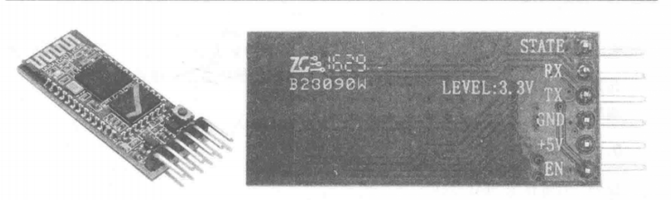

# devil-box-arduino

A app built by react native, where you can set your tasks,and when the presetted time come, the relative devil box will remind you to do your tasks.

<br/>
<br/>
<br/>
<br/>
<br/>
<br/>

<div align="center">
</div>
<center>
<br/>
<br/>
<br/>
<br/>
<br/>
<br/>
<font size="7" face="黑体" >技术开发过程与验证报告</font>
<br/>
<br/>
<font size="4" face="黑体">课程名称：	技术创意</font>
<br/>
<font size="4" face="黑体">小组成员：	沈丹琼 张昕怡 云菲</font>
<br/>
<font size="4" face="黑体">学    院：	计算机科学与技术学院</font>
<br/>
<font size="4" face="黑体">专    业：	数字媒体技术</font>
<br/>
<br/>
<font size="4" face="黑体">2020 年  06  月  25   日</font>
<br/>
</center>
<br/>
<br/>
<br/>
<br/>
<br/>
<br/>
<br/>


<center> <font size="6">目录</font></center>
</br>

[TOC]

## 1 产品背景

很多人在工作或学习的时候，最大的干扰就是手机。手机上有很多app为控制手机使用而生，它们可以帮助你在做正事时免于干扰。但是，它们最大的问题在于，“开始使用”这一动作的控制权完全在你自己手上，即使你预先设想了某段时间要做什么样的任务，你也放不下手里的手机，更不会打开效率软件，专注就成了无稽之谈。

我们设想这样一个手机盒子，它可以预先设置日程，且不可随意更改。在既定的时间到来时，它会播放音乐、噪音、语音，或者震动、跳跃，直至你把手机放进盒子里，它才会安静下来。手机需要等到用户设定的时间之后才能解锁。

我们希望用户对自己的日程规划是比较明晰的。一是用户会预先设定接下来的日程，日程不可随意更改，这样手机盒子就能成为协助日程完成的“魔鬼”管家；二是减少在使用手机盒子期间，突然事件的发生。当然出于对紧急情况的考虑，我们会在盒子上设置紧急按钮，供用户在特殊情况下取出手机。按钮的使用次数是有限的，避免用户滥用这一设置。

 

## 2 技术方案概述

考虑到小组人数限制以及各自的技能特长，我们将产品的技术开发划分为三个方向，包括建模、硬件开发和软件开发。
建模主要负责外观设计和内部硬件结构设计，使用犀牛进行建模；硬件方面使用arduino开发板，实现手机盒子声音播放，通过蓝牙接收手机app发送的日程数据，usb连接检测功能；app方面使用react native框架，实现日程的设定，蓝牙检测与连接，usb连接检测与数据发送等。

## 3 安卓app

github项目地址：https://github.com/dandanDQ/devil-box-arduino

### 功能描述

软件的功能分为三个部分。
第一部分是日程的内容和时间设定,第二部分是蓝牙的连接及数据发送,第三部分是USB的连接与连接状态确认.

### 交互与界面设计

#### 主界面

主界面由输入框、各种功能按钮、蓝牙扫描结果列表构成。


#### 时间选择界面
点击选择时间将跳转到时间选择界面。


#### 日程添加结果


### 技术细节

#### 日程时间与内容设定


时间选择框的动态展示，使用 modal 组件来实现，这是一个覆盖在其他视图上显示内容的模块。模块的展示与否使用变量控制，而按钮的点击可修改变量值，从而实现 modal 框的动态显示。

```
<Modal
visible = {this.state.timeSelect}
onRequestClose={this.timeSelected}
transparent={false}>
<View style={styles.timeChooseWrapper}>
<Text  style={styles.textStyle}>Start Time</Text>
<!-- ... --!>
<Text style={styles.textStyle}>End Time</Text>
<Button
     title="确定"
     onPress={this.timeSelected}
     color="#009ad6"
     ></Button>
</View>
</Modal>
```
时间选择框，从属性栏获取初始值，并初始化参数。根据这些参数渲染出日期和时间，参数用于控制选择方式，日期列表，时间间隔等。
用户选择日期时间后，将调用函数，将更改的结果同步到数据项中，主界面将根据这些数据来设定日程时间日期。

```
//处理时间和日期的自定义展示
  componentDidMount = () => {
    const {
      pickerType,
      returnDateFormat,
      returnTimeFormat,
      returnDateTimeFormat,
      minDate,
      maxDate,
      defaultSelected,
      dayFormat,
      monthFormat,
      yearFormat,
      timeFormat,
      onDateSelected,
      onTimeSelected,
      onDateTimeSelected,
    } = this.props;
    let dateArray = [];
    let timeArray = [];

    if (minDate && maxDate) {
      if (pickerType === 'date' || pickerType == 'datetime') //..
      if (pickerType === 'time' || pickerType == 'datetime') {
      //...
      }
    } else if (minDate) {
      //...
    } else if (maxDate) {
      //...
    } else {
      //...
    }

    const newDateArray = dateArray.map(item => ({
      date: item,
      day: moment(item, defaultFormatDate).format(dayFormat),
      month: moment(item, defaultFormatDate).format(monthFormat),
      year: moment(item, defaultFormatDate).format(yearFormat),
      isSelected: false,
    }));
    let isCurrentFoundDate = false;
    if (defaultSelected) {
      //..
    } else if (newDateArray.length > 0) //...

    const newTimeArray = timeArray.map(item => ({
      time: item,
      timeDisplay: moment(item, defaultFormatTime).format(timeFormat),
      isSelected: false,
    }));
    let isCurrentFoundTime = false;
    if (defaultSelected) {
      //...
    } else if (timeArray.length > 0) newTimeArray[0].isSelected = true;
    if ((pickerType === 'date' || pickerType == 'datetime') && onDateSelected) {
        //...
      } else {
        //...
      }
    }
    if ((pickerType === 'time' || pickerType == 'datetime') && onTimeSelected) {
    //...
      } else {
    //...
      }
    }
    if (onDateTimeSelected) {//...
    }
    this.setState({
      arrayDates: newDateArray,
      arrayTimes: newTimeArray,
      yearSelected: newDateArray.length > 0 && newDateArray[0].year,
    });
  };
```

选择结果的同步与任务列表的添加

```
//选择结果同步
  onStartTimeSelected =res => {
    this.setState({ start:res.datetime});
  }
//将任务添加到本地列表
  addTodo = () =>{
    this.setState({items:[{
      start: this.state.start,
      end:this.state.end,
      todo: this.state.todo,
      key: this.state.start+this.state.end+new Date(),
    },...this.state.items]})
    //console.log(this.state.items);
  } 
```

任务列表的动态展示,列表与数据items绑定，items由任务列表添加 和发送结果来控制。

```
<SwipeListView
data = {this.state.items}
renderItem ={
  (data,rowMap) => (
    <View style={{padding:5}}>
      <Text>todo:{data.item.todo}</Text>
      <Text>start time:{data.item.start}</Text>
      <Text>end time:{data.item.end}</Text>
    </View>
  )
}
>
</SwipeListView>
```

#### 蓝牙的连接与格式化数据发送

蓝牙功能需要连接安卓原生模块，使用java脚本连接react native框架与原生模块。

```
//BleManager.java

class BleManager extends ReactContextBaseJavaModule implements ActivityEventListener {
    //类的构造
    public BleManager(ReactApplicationContext reactContext) {
		super(reactContext);
		context = reactContext;
		this.reactContext = reactContext;
		reactContext.addActivityEventListener(this);
		Log.d(LOG_TAG, "BleManager created");
	}
    //蓝牙连接
    @ReactMethod
	public void connect(String peripheralUUID, Callback callback) {
		Log.d(LOG_TAG, "Connect to: " + peripheralUUID);

		Peripheral peripheral = retrieveOrCreatePeripheral(peripheralUUID);
		if (peripheral == null) {
			callback.invoke("Invalid peripheral uuid");
			return;
		}
		peripheral.connect(callback, getCurrentActivity());
	}
    //数据写入
    @ReactMethod
	public void write(String deviceUUID, String serviceUUID, String characteristicUUID, ReadableArray message,
			Integer maxByteSize, Callback callback) {
		Log.d(LOG_TAG, "Write to: " + deviceUUID);
		if (serviceUUID == null || characteristicUUID == null) {
			callback.invoke("ServiceUUID and characteristicUUID required.");
			return;
		}
		Peripheral peripheral = peripherals.get(deviceUUID);
		if (peripheral != null) {
			byte[] decoded = new byte[message.size()];
			for (int i = 0; i < message.size(); i++) {
				decoded[i] = new Integer(message.getInt(i)).byteValue();
			}
			Log.d(LOG_TAG, "Message(" + decoded.length + "): " + bytesToHex(decoded));
			peripheral.write(UUIDHelper.uuidFromString(serviceUUID), UUIDHelper.uuidFromString(characteristicUUID),
					decoded, maxByteSize, null, callback, BluetoothGattCharacteristic.WRITE_TYPE_DEFAULT);
		} else
			callback.invoke("Peripheral not found");
	}
    //扫描蓝牙设备
    public void start(ReadableMap options, Callback callback) {
		Log.d(LOG_TAG, "start");
		if (getBluetoothAdapter() == null) {
			Log.d(LOG_TAG, "No bluetooth support");
			callback.invoke("No bluetooth support");
			return;
		}
		forceLegacy = false;
		if (options.hasKey("forceLegacy")) {
			forceLegacy = options.getBoolean("forceLegacy");
		}

		if (Build.VERSION.SDK_INT >= LOLLIPOP && !forceLegacy) {
			scanManager = new LollipopScanManager(reactContext, this);
		} else {
			scanManager = new LegacyScanManager(reactContext, this);
		}

		IntentFilter filter = new IntentFilter(BluetoothAdapter.ACTION_STATE_CHANGED);
		filter.addAction(BluetoothDevice.ACTION_BOND_STATE_CHANGED);
		context.registerReceiver(mReceiver, filter);
		callback.invoke();
		Log.d(LOG_TAG, "BleManager initialized");
	}
}
```

用js方法对原生模块进行包装

```
//数据扫描
scan(serviceUUIDs, seconds, allowDuplicates, scanningOptions = {}) {
    return new Promise((fulfill, reject) => {
      if (allowDuplicates == null) {
        allowDuplicates = false;
      }

      // (ANDROID) Match as many advertisement per filter as hw could allow
      // dependes on current capability and availability of the resources in hw.
      if (scanningOptions.numberOfMatches == null) {
        scanningOptions.numberOfMatches = 3;
      }

      // (ANDROID) Defaults to MATCH_MODE_AGGRESSIVE
      if (scanningOptions.matchMode == null) {
        scanningOptions.matchMode = 1;
      }

      // (ANDROID) Defaults to SCAN_MODE_LOW_POWER on android
      if (scanningOptions.scanMode == null) {
        scanningOptions.scanMode = 0;
      }

      if (scanningOptions.reportDelay == null) {
        scanningOptions.reportDelay = 0;
      }

      bleManager.scan(
        serviceUUIDs,
        seconds,
        allowDuplicates,
        scanningOptions,
        error => {
          if (error) {
            reject(error);
          } else {
            fulfill();
          }
        }
      );
    });
  }
//连接设备
connect(peripheralId) {
    return new Promise((fulfill, reject) => {
      bleManager.connect(peripheralId, error => {
        if (error) {
          reject(error);
        } else {
          fulfill();
        }
      });
    });
  }
```


## 4 建模

外观共经过四次迭代。
### 第一稿：猫猫头
#### 内部结构


#### 外部轮廓


#### 外壳
 

#### 设计说明
外壳分为球形外壳和毛绒外套。
球形外壳分上下两个半球形外壳，由连接零件连接，USB接口置于两个半球形外壳之间，下层外壳用于置放硬件并且有开口用于充电。上下外壳里部有内陷凹槽用于放置手机，当用户打开上下外壳并将手机接上USB接口后合并外壳，手机就可平放在外壳内部。
毛绒外套做成猫的形状，大小贴合塑料外壳。外套有两层，中间用于填充棉花做塑料外壳的弹跳缓冲保护。猫的尾巴可拆卸，尾巴拆下来的接口对硬塑料外壳的充电接口。

#### 迭代原因
由于内部需要放置的硬件过大，而外壳的设计布局采用下层半圆球放置硬件。经过计算，外壳的成品将会有一个篮球那么大。由于体积过大，在产品弹跳时，由撞击对外壳产生的冲击力过大，对产品的损坏将会比较严重。
因此，在第二稿的时候采用了体积较小的外观设计，并且在产品功能的设计上，将弹跳改为了走动。

### 第二稿：哆啦A梦
#### 外观
       


#### 设计说明
外观采用经典卡通角色哆啦A梦的造型设计，内部中空，硬件固定在机器猫腹部，充电口设置在尾巴位置。机器猫的尾巴可拆卸，充电时可将尾巴卸下露出充电孔的位置，等到充电结束后再将尾巴扣上。机器猫的口袋用于放手机，到了设定时间后可将口袋拉出放入手机，强制时间结束后可将手机取出，然后将口袋推回原来位置。

#### 迭代原因
采用哆啦A梦的形象涉及到原作的版权，且体积依然很大。
因此，第三稿延用了第一稿的猫猫头设计，并继续采用弹跳设计。但是将手机和硬件置放的地方分开两个，大大减小了猫猫头的体积。

### 第三稿：猫猫头+喂食机
#### 外观
#### 放手机

 
#### 放硬件
 

#### 整体
 

#### 设计说明
整体：
外壳整体采用自动喂食器喂猫的概念，将产品分为自动喂食器模型和猫模型。当到了设定时间后猫会自动弹跳并发出噪音，这时需要打开自动喂食器模型将手机放进去，猫模型才会安静下来。
自动喂食器模型：
高的圆柱筒用来放手机，表示猫粮进桶。较宽的喂食槽上有个凹陷的圆块用来放猫模型，表示猫在吃猫粮。
猫模型：
内壳采用塑料材质，外壳采用毛绒材质做成猫的外形。零件板放在内壳中间的立方块里面，接出充电口到尾巴位置，充电时可以把尾巴卸下来。

#### 迭代原因
在产品启动之前，猫猫头是置于自动喂食机上的。一旦到了设定的时间，猫猫头开始弹跳，将会对底座产生较大的冲击力。并且，讲产品分开成两个模型会耗费更多的材料，虽然单体体积缩小了，但整体的占地面积还是不太可观。
因此，第四稿摒弃了弹跳功能，并且为了减小产品体积，将外壳从球体变为立方体。

### 第四稿：手机盒子
#### 建模
 

#### 尺寸
      
    

#### 渲染
 
 
#### 爆炸图
 

#### 设计说明
盒子呈立方体，内部中空用于置放硬件。外壳有一个凹槽用于放手机，凹槽的底部开孔用来放USB接口。外壳的背面有一个圆形小孔，与内置的硬件底板上的充电孔相对。外壳底部设有底板，将硬件放入外壳后，封上底板。

#### 实际改动
由于产品体积较大，且具有内部结构，3D打印费用较高。为了节省成本，盒子高度降为13cm，内部用于放手机的凹槽结构高度降为6cm。

#### 造型优点
1、	体积：在硬件大小固定不变的情况下，立方体的外形设计将会比球形外形设计的体积更小。
2、	使用：产品设计的主要目的是将禁止用户玩手机，因此产品需要将手机全部遮挡或者部分遮挡。第一稿和第二稿的手机存放设计都需要将产品打开才能将手机放进去，这在耗时上会比直接放手机久。并且在手机插上USB后，还需要将产品开口合上才能停止蜂鸣器喊叫，使用操作上不如当前产品的设计方便。
3、	摆放：立方体比球体更易于平稳摆放。

## 5 arduino 硬件与程序

### 硬件清单
开发板：Arduino
Arduino是一个基于易用硬件和软件的原型平台（开源）。它由可编程的电路板（称为微控制器）和称为Arduino IDE（集成开发环境）的现成软件组成，用于将计算机代码写入并上传到物理板。

通信：
无线蓝牙：HC-05蓝牙模块


HC-05蓝牙模块支持主从模式，即可以连接其他蓝牙（主模式）或者被其他蓝牙设备连接（从模式）。
给模块上电会进入正常工作模式（该模式下蓝牙未配对时指示灯快闪），配对成功后指示灯常亮。

有线连接：USB2.0 AM/BM+otg转接头


### 整体代码
```
//信号输出引脚
#define BEEP_PIN 3

void setup()
{
  //设置波特率
    Serial.begin(9600);
}

void loop()
{
    String comdata;
    //当缓冲区有数据，读取字符串
    while(Serial.available()>0)
    {
        comdata+=char(Serial.read());
        delay(2);
    }
    if(comdata.length()>0)
    {
        //如果是时间数据，就在等待相应时间后响起警报
        if(comdata.startsWith("t"))
        {
          int divide=comdata.indexOf(',');
          int l=comdata.length();
          int t1=comdata.substring(1,divide).toInt();
          int t2=comdata.substring(divide+1,l).toInt();
          Serial.print(t1);
          Serial.print(t2);
          delay(t1*60000);
          Serial.print("delay");
          int i;
          for(i=0;i<t2*6;i++){
            Serial.print(i);
//连接手机后，收到数据则停止鸣叫
            if(Serial.available()>0&&Serial.read()=='2'){
              Serial.print(char(Serial.read()));
              Serial.print("loop_2");
              delay(10000);
            }
            else{
                Serial.print("loop_beep");
                pinMode(BEEP_PIN,OUTPUT);
                tone(BEEP_PIN,294);
                delay(10000);
                pinMode(BEEP_PIN,INPUT);
            }    
          }
          comdata="";
        }
    }
}

```


## 6 问题及解决方案

#### 任务时间内，怎么确保用户没有使用手机
问题:盒子设计的初衷是控制用户玩手机时间，我们需要确保三件事，一是用户放进去的是真正的手机，而不是类似外形的东西，所以不能简单使用重量检测；另一方面，我们需要确保用户把手机放进去之后，无法再操作手机，应当将手机存放于较为密闭的空间里；最后要确保用户在任务时间内没有拿出手机，所以要进行持续性的连接状态检测。
解决方案：采用 usb 连接手机，检测连接状态，以确保用户放进盒子里的是手机，且在任务时间内没有拿走手机；另外使用插槽将手机包裹，保证在连接状态下用户无法接触到手机。

#### usb 无法检测连接状态

问题：arduino开发板不能直接检测到usb连接状态，无法通过状态检测获取手机连接状态。
解决方案：手机和arduino开发板通过usb连接后，手机通过程序不断发送数据实现连接状态确认。开发板则通过一定时间间隔内读取数据缓存区内容的方式，确认手机连接状态。

#### 模型版权问题、模型细节过多
问题：我们原先借用了哆啦A梦原型作为造型，认为这能让产品吸引更多关注。但是考虑到参赛要求，这样的作法侵犯了ip权。另外，这样的
解决方案：重新设计外形并建模，将外形简化为方盒子，只保留实现产品功能所需要的设计

#### 开发板较大，导致模型较大，价格昂贵
问题：我们购买的开发板，因为原本是用于开发
解决方案：减少手机覆盖面积，外壳底座缩减


#### 蓝牙权限问题
问题：在进行调试的时候，可以检查到周围蓝牙设备，但是生成app之后却无法检测到任何设备。
解决方案：增加权限获取请求。
```
  if (Platform.OS === 'android' && Platform.Version >= 23) {
      PermissionsAndroid.check(PermissionsAndroid.PERMISSIONS.ACCESS_COARSE_LOCATION).then((result) => {
          if (result) {
            console.log("Permission is OK");
          } else {
            PermissionsAndroid.request(PermissionsAndroid.PERMISSIONS.ACCESS_COARSE_LOCATION).then((result) => {
              if (result) {
                console.log("User accept");
              } else {
                console.log("User refuse");
              }
            });
          }
    });
  }
```


